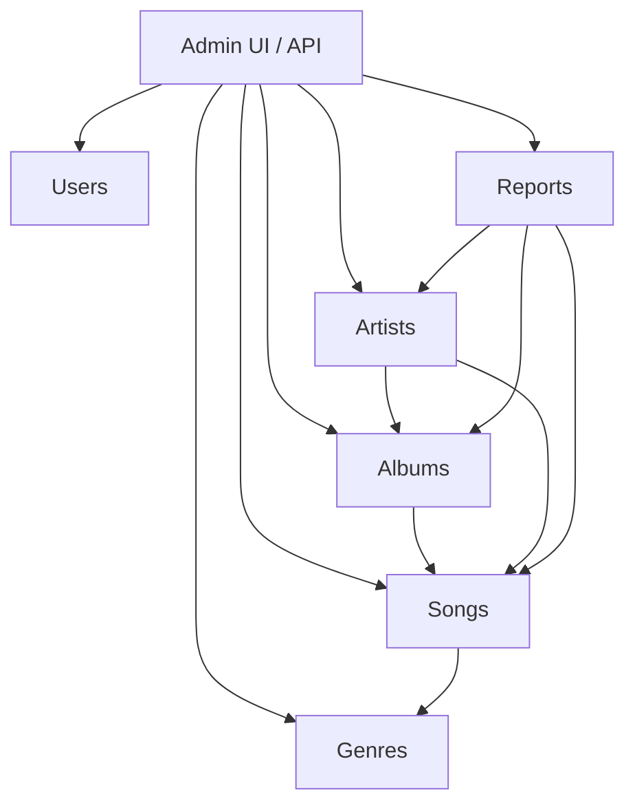

# Echo Panda — Admin System (Overview)

This document summarizes the admin responsibilities, architecture, and implementation notes for the Echo Panda platform admin system.

**Purpose:** provide a single-file reference the team can use for architecture, docs, and implementation planning.

**Scope:** full music platform admin system (artist & user management, content moderation, genres, reporting, deactivation).

---

**Artist Management**: admin controls the entire artist lifecycle

- Create artist accounts manually
- Approve / reject artist verification requests
- Activate / deactivate artist accounts
- View artist profiles (uploads, stats, activity)
- Suspend artists for violations

---

**User Management**

- View all users
- Ban / unban users
- Reset user status
- Monitor user activity (listening behaviour, reports)

---

**Song & Album Management**

- View all songs and albums
- Approve / reject uploads (moderation)
- Edit metadata (`title`, `cover`, `genre`, `tags`)
- Delete or restore songs/albums
- Disable specific tracks without deleting them

---

**Content Moderation**

- Review reported songs/albums/artists
- Actions: remove content, warn artist, suspend account
- Categorize reports (copyright, inappropriate, spam, fake accounts)

---

**Genres & Categories Management**

- Create / edit / delete genres
- Assign genres to songs/albums
- Manage category hierarchy
- Ensure consistent tagging system

---

**Deactivation System**

- Disable songs without deleting them
- Deactivate albums
- Suspend or deactivate artists
- Reactivate content when resolved

---

**Reporting System**

- View user reports (song, album, artist)
- Categorize and take action + log decisions

---

## Simple Architecture View

---

## Important Design Insight (Laravel)

You will likely need the following roles and core tables to implement this cleanly in Laravel.

**Roles**

- `admin`
- `artist`
- `user`

**Core tables / models**

- `users`
- `artists` (profile extension or linked to `users`)
- `songs`
- `albums`
- `genres`
- `reports`

---

## Implementation notes / next steps

- Add admin routes and controllers (e.g. `Admin\ArtistController`, `Admin\SongController`, `Admin\ReportController`).
- Implement middleware and policy checks for `admin` role.
- Add audit logs for moderation actions.

---

Created for: back-end Echo Panda admin architecture and docs.
